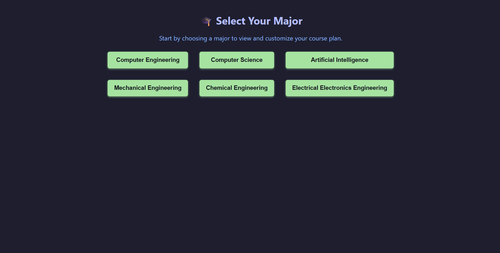
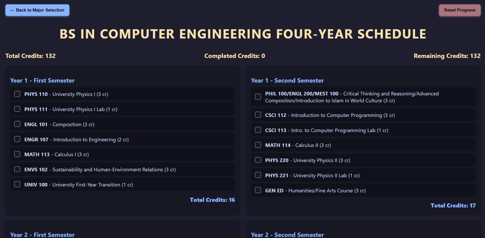
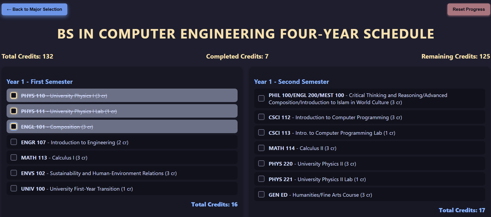

# AURAK Catalog 

**Live Demo:** [https://abidzzz.github.io/aurak-catalog/](https://abidzzz.github.io/aurak-catalog/)  

A personal project built with **React.js** to help AURAK students easily manage and track their course progress.  
Select your **major**, then **drag & drop** courses and **check/uncheck** the ones you’ve completed.

---
## Screenshots





---

## ✨ Features

- Select your major
- Drag and drop courses between sections
- Mark courses as completed
- Saves progress locally (optional)

---
## License

This project is licensed under the **GNU General Public License v3.0**.

---
## 🚀 Getting Started

To run the project locally:

```bash
# Clone the repo
git clone https://github.com/abidzzz/aurak-catalog.git

# Navigate into the directory
cd aurak-catalog

# Install dependencies
npm install

# Start the development server
npm start
```
---
## TODO:
- Find a better way to store courses instead of `courses.js`
- Fix course selection behavior: allow clicking on course name to select/unselect even with drag-and-drop active
- Show prerequisites for each course
- Fix course selection when prerequisites aren't completed
- Add more courses
- Implement mobile view

---
## Contributing

Contributions are welcome! If you have any suggestions or improvements, feel free to open an issue or submit a pull request.